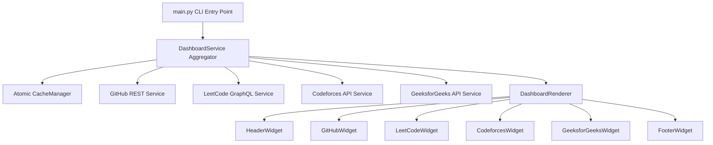

# ⚡ DevPulse - Modern Developer Dashboard

<p align="center">
  
  
  
  
</p>

**DevPulse** is a lightweight, high-performance, and visually striking terminal developer dashboard written in Python. It aggregates live metrics from **GitHub**, **LeetCode**, **Codeforces**, and **GeeksforGeeks** concurrently, rendering a side-by-side UI layout directly in your CLI.

---

```text
┌─────────────────────────────────────────────────────────────────────────────┐
│                             ⚡   DEVPULSE   ⚡                              │
│   Refreshed: 20:38:12 India Standard Time (Just now)  •  Theme: github-dark  │
│                              •  Status: ONLINE                              │
└─────────────────────────────────────────────────────────────────────────────┘
┌───────────── 🐙 GitHub (https://github.com/Reaven010) ─────────────┐
│                                                                    │
│  👤 sayujya tiwari (@Reaven010)              ⭐ Stars (Recent): 0  │
│  Public Repos: 20  •  Followers: 3  •  Following: 3                │
│                                                                    │
│   Recent Repository           Language           Stars     Forks   │
│   DevPulse                    🟡 Python           ⭐ 0       ⑂ 0   │
│   learning                    🔵 C++              ⭐ 0       ⑂ 0   │
│   yt-recommender              🟡 Python           ⭐ 0       ⑂ 0   │
│   Vtiyarthi-OSS               🟢 Shell            ⭐ 0       ⑂ 0   │
│                                                                    │
└────────────────────────────────────────────────────────────────────┘
┌──────── 🧩 LeetCode (https://leetcode.com/sayujya_tiwari) ─────────┐
│                                                                    │
│  👤 sayujya tiwari (@sayujya_tiwari)        Global Rank: #964,975  │
│  Contest Rating: 1411.6 (Top 81.63%)                  Attended: 3  │
│                                                                    │
│   Difficulty           Progress Bar                        Count   │
│   Easy                 █████████░░░░░░░                       91   │
│   Medium               ██████░░░░░░░░░░                       64   │
│   Hard                 ███░░░░░░░░░░░░░                       18   │
│                                                                    │
│   Recent Accepted Problem              Language           Status   │
│   Subarrays with K Different Integers  🔵 cpp         ✓ Accepted   │
│   Two Sum                              🔵 cpp         ✓ Accepted   │
│   Method Chaining                      🟡 pythondata  ✓ Accepted   │
│                                                                    │
└────────────────────────────────────────────────────────────────────┘
┌─────────────────────────────────────────────────────────────────────────────┐
│  💻 CPU █░░░░░░░ 12.0%  │  🧠 RAM ██████░░ 72.0%    DevPulse v0.1.0     │
│                     Press Ctrl+C / [Q] to quit  •  [R] to refresh          │
└─────────────────────────────────────────────────────────────────────────────┘
```

---

## ✨ Features

- 🚀 **Concurrent Multi-Service Aggregation**: Parallel worker pools (`ThreadPoolExecutor`) fetch statistics across all enabled services simultaneously in under 1 second.
- 🐙 **GitHub Integration**: Public repository statistics, language usage, stars, followers, and recent repository updates.
- 🧩 **LeetCode Integration**: Contest rating, global ranking, difficulty problem breakdown with visual progress bars, and recent accepted submissions.
- ⚔️ **Codeforces Integration**: Official API integration for handle rating, rank badges (`Legendary Grandmaster`), contribution score, total solved count, and recent submissions.
- 🟢 **GeeksforGeeks Integration**: Overall coding score, institute rank, and difficulty breakdown (School/Basic, Easy, Medium, Hard).
- ⚡ **Atomic TTL Caching**: Thread-safe JSON envelope storage prevents API rate limiting and delivers instantaneous dashboard refreshes.
- 🎨 **Multiple Color Themes**: Built-in support for `github-dark`, `dracula`, `catppuccin`, `nord`, and `tokyonight` color palettes.
- 🔄 **Flicker-Free Live Watch Mode**: Continuously monitors and updates stats in real time using `rich.live.Live`.
- 💻 **System Resource Gauges**: Displays live CPU & RAM utilization progress bar gauges in the dashboard footer.

---

## 🏗️ Architecture Overview



---

## 🚀 Quick Start

### 1. Clone & Install Dependencies

```bash
git clone https://github.com/Reaven010/DevPulse.git
cd devpulse
python -m venv .venv
source .venv/bin/activate  # On Windows: .venv\Scripts\activate
pip install -r requirements.txt
```

### 2. Configure Your Handles

Edit `config/config.toml` (or copy from `config/config.example.toml`) to set your usernames:

```toml
[general]
theme = "github-dark"
refresh_interval = 300
log_level = "INFO"

[github]
enabled = true
username = "Reaven010"

[leetcode]
enabled = true
username = "sayujya_tiwari"

[codeforces]
enabled = true
username = "shubhtiwari19419"

[geeksforgeeks]
enabled = true
username = "reaven010"
```

### 3. Run DevPulse

```bash
# Single-shot render
python src/main.py

# Live watch mode (refreshes every 15 seconds)
python src/main.py --watch --interval 15

# Launch with a custom theme
python src/main.py --theme dracula

# Bypass cache and force fresh API fetch
python src/main.py --refresh
```

---

## ⚙️ CLI Options

| Flag | Type | Description | Default |
|---|---|---|---|
| `--watch` | Flag | Continuous live watch mode with flicker-free updates | `False` |
| `--interval` | Integer | Refresh interval in seconds during watch mode | `30` |
| `--theme` | String | Override active color theme (`github-dark`, `dracula`, `catppuccin`, `nord`, `tokyonight`) | `config.toml` |
| `--refresh` | Flag | Force fresh API fetch, bypassing local TTL cache | `False` |

---

## 🧪 Testing

Run the automated test suite using `pytest`:

```bash
python -m pytest tests/
```

All 23 test cases cover cache thread-safety, logger rotation, service clients, and widget rendering.

---

## 📂 Project Structure

```text
devpulse/
├── config/
│   ├── config.toml           # Active user configuration
│   └── config.example.toml   # Example configuration template
├── logs/                     # Rotating application log files
├── cache/                    # Thread-safe JSON cache envelopes
├── src/
│   ├── common/
│   │   ├── config.py         # TOML configuration loader
│   │   ├── cache.py          # Atomic JSON cache manager
│   │   └── logger.py         # Singleton rotating file logger
│   ├── services/
│   │   ├── github.py         # GitHub REST service
│   │   ├── leetcode.py       # LeetCode GraphQL service
│   │   ├── leetcode_queries.py # Isolated GraphQL query strings
│   │   ├── codeforces.py     # Codeforces API service
│   │   └── geeksforgeeks.py  # GeeksforGeeks service
│   └── dashboard/
│       ├── models.py         # Aggregated DashboardData container
│       ├── dashboard_service.py # Concurrent service aggregator
│       ├── theme.py          # Color palette theme engine
│       ├── icons.py          # Icon mappings & UTF-8 fallbacks
│       ├── renderer.py       # Pure layout orchestrator
│       └── widgets/          # Isolated UI widget components
│           ├── header.py
│           ├── github.py
│           ├── leetcode.py
│           ├── codeforces.py
│           ├── geeksforgeeks.py
│           └── footer.py
└── tests/                    # Unit test suite
```

---

## 📄 License

This project is licensed under the **MIT License**. See the [LICENSE](LICENSE) file for details.


## Daily Activity Log
- [2026-08-02 23:58:31] Automated activity update (1/7)
- [2026-08-02 23:58:35] Automated activity update (2/7)
- [2026-08-02 23:58:39] Automated activity update (3/7)
